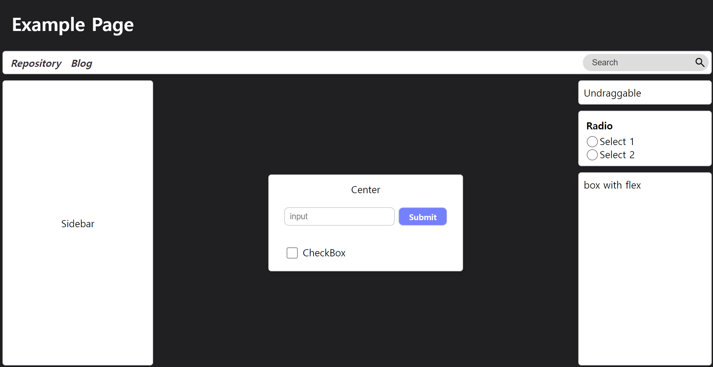

# CSS-FLEX

css의 flex 속성에 대해 flutter와 유사한 문법을 적용하기 위한 저장소입니다

## 특징

- `row`, `column`, `center` 등의 클래스를 통한 flex 속성 적용
- 일부 태그의 스타일 변화 (input, a 등...)
- 그 외

## 수정 및 추가시

`./trace.sh` 실행 중 `styles/` 내 파일을 수정 시 style.css에 자동으로 반영됩니다